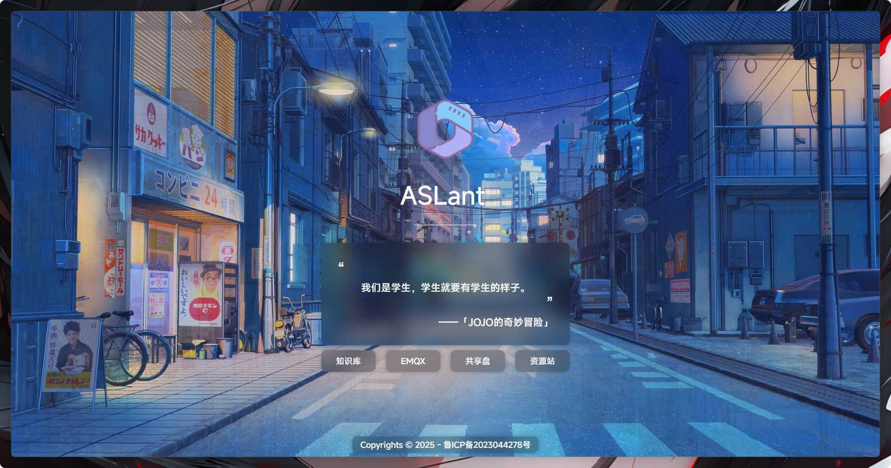

# Box（浏览器 Plus）

[](https://github.com/Y-ASLant/Box/actions/workflows/release.yml)

Box 是一个面向演示、展厅和固定终端场景的无边框 Electron 浏览器。应用可从本地登录页输入地址，也可通过配置直接加载 HTTP(S) 页面，并为页面提供悬浮窗口控制面板。



## 功能

- 无边框主窗口和悬浮控制面板
- 全屏、置顶和单页运行模式
- 主窗口与受管子窗口
- 浅色、深色和系统主题
- 最近访问地址与缓存清理
- 可配置背景、滚动条、鼠标和控制按钮
- URL 加载失败时显示本地错误页

> [!IMPORTANT]
> Box 面向受控展示环境，并默认信任加载的远程页面。应用会忽略证书错误、关闭 Electron Web Security、放宽 CSP，并向远程页面注入窗口控制能力。不要用它浏览不可信网站，也不要把这些 UI 限制视为安全边界。

## 环境要求

- Node.js 22.12 或更高版本
- pnpm 12.4.2 或更高版本

```bash
corepack enable pnpm
pnpm install
```

## 开发

```bash
pnpm start        # 启动 Electron 开发模式
pnpm dev          # 仅启动 Vue/Vite renderer
pnpm preview      # 预览 renderer 生产构建
pnpm check        # 检查 renderer、Electron、shared 和构建配置
pnpm build        # 类型检查并构建 renderer
```

`pnpm start` 和 Electron 打包命令会按需准备当前平台的 Electron 运行时，首次执行需要联网下载。

项目当前没有自动化测试、lint 或格式化命令，`pnpm check` 是提交前的静态检查入口。

## 打包

```bash
pnpm build:electron  # 检查并按当前平台打包
pnpm build:win       # Windows x64 NSIS
pnpm build:mac:x64   # macOS Intel DMG
pnpm build:mac:arm64 # macOS Apple Silicon DMG
pnpm build:linux:x64 # Linux x64 AppImage、deb 和 rpm
pnpm build:linux:arm64 # Linux arm64 AppImage、deb 和 rpm
```

跨架构命令应在相同 CPU 架构的系统上运行，避免把当前平台的 Electron 运行时装入错误架构的安装包。产物位于 `build/`，文件名包含版本、平台和架构。也可以使用 Make：

```bash
make build       # 完整打包，成功后仅保留发布文件
make clean       # 删除构建产物、缓存、日志和临时文件
make distclean   # clean 后继续删除 node_modules 和仓库内 pnpm store
```

`dist/`、`dist-electron/` 和解包目录是生成内容，不应手动编辑。

## 发布

推送 `v1.0.0` 或 `V1.0.0` 这类 SemVer 标签会触发 [Release 工作流](.github/workflows/release.yml)。工作流会先确认标签版本与 `package.json` 一致，并检查 [CHANGELOG.md](CHANGELOG.md) 中存在相同版本的中英文条目；全部平台构建成功后，才会创建 GitHub Release。

发布新版本时：

1. 更新 `package.json` 的 `version`。
2. 将 `CHANGELOG.md` 的未发布内容整理到同一版本号和日期下，中英文部分都要更新。
3. 完成本地检查后提交代码，再创建并推送标签。

```bash
pnpm check
git tag v1.0.0
git push origin v1.0.0
```

正式版本会标记为 Latest Release，带预发布后缀的版本（例如 `v1.1.0-beta.1`）会标记为 Pre-release。Release 正文直接取自对应版本的 `CHANGELOG.md`，并附带以下构建产物：

| 平台 | 架构 | 格式 |
| --- | --- | --- |
| Windows | x64 | NSIS `.exe` |
| macOS | x64、arm64 | `.dmg` |
| Linux | x64、arm64 | `.AppImage`、`.deb`、`.rpm` |

## 配置

应用启动时读取当前工作目录中的 `config.json`。配置文件优先于命令行参数，未配置的项目使用默认值。

```json
{
  "link": "https://example.com",
  "mode": "fullscreen",
  "window": "top",
  "page": "single",
  "theme": "dark",
  "hide": "home,close,scroll",
  "bg": "C:/path/to/background.jpg"
}
```

| 配置字段 | 命令行参数 | 可用值 | 说明 |
| --- | --- | --- | --- |
| `link` | `-link=<url>` | HTTP(S) 地址、域名或 IP | 启动后直接加载页面 |
| `mode` | `-mode=<mode>` | `fullscreen`、`normal` | 窗口模式 |
| `window` | `-window=<type>` | `top`、`normal` | 是否始终置顶 |
| `page` | `-page=<type>` | `single`、`multi` | 单页模式下主页按钮打开用户目录 |
| `theme` | `-theme=<theme>` | `light`、`dark` | 本地页面主题 |
| `hide` | `-hide=<items>` | 见下表 | 逗号分隔的隐藏项 |
| `bg` | `-bg=<path>` | 本地文件路径 | 登录页背景图片；相对路径基于当前工作目录 |

无效的配置类型、枚举值和隐藏项会被忽略，并在主进程日志中说明原因。

### 可隐藏元素

| 值 | 效果 |
| --- | --- |
| `control` | 隐藏整个悬浮控制面板 |
| `theme` | 隐藏本地页面的主题按钮 |
| `scroll` | 隐藏滚动条但保留滚动能力 |
| `mouse` | 隐藏鼠标光标，输入区域仍显示文本光标 |
| `home` | 隐藏主页按钮 |
| `minimize` | 隐藏最小化按钮 |
| `maximize` | 隐藏最大化按钮 |
| `close` | 隐藏关闭按钮 |
| `fullscreen` | 隐藏全屏按钮 |

开发模式下可直接传递参数：

```bash
pnpm start -link=https://example.com -theme=dark -hide=scroll
```

## 操作

- 按下 `Ctrl + Shift + Alt` 切换悬浮控制面板。
- 主窗口的系统关闭操作会最小化窗口；使用控制面板的关闭按钮退出。
- F12、开发者工具快捷键、右键菜单和 Alt+F4 在应用窗口内被拦截。

## 项目结构

```text
src/       Vue 本地登录页、错误页、路由和主题
electron/  Electron 主进程、预加载、IPC、窗口和会话策略
shared/    跨进程类型、URL 处理、注入脚本和样式
assets/    应用图标和文档截图
```

启动链路为 `electron/main.ts` → `electron/app-lifecycle.ts` → `electron/window-manager.ts`。需要特权能力时应保持以下边界：

```text
Vue/注入控件 → preload 固定方法 → IPC handler → Electron 操作
```

## License

[MIT](LICENSE)
