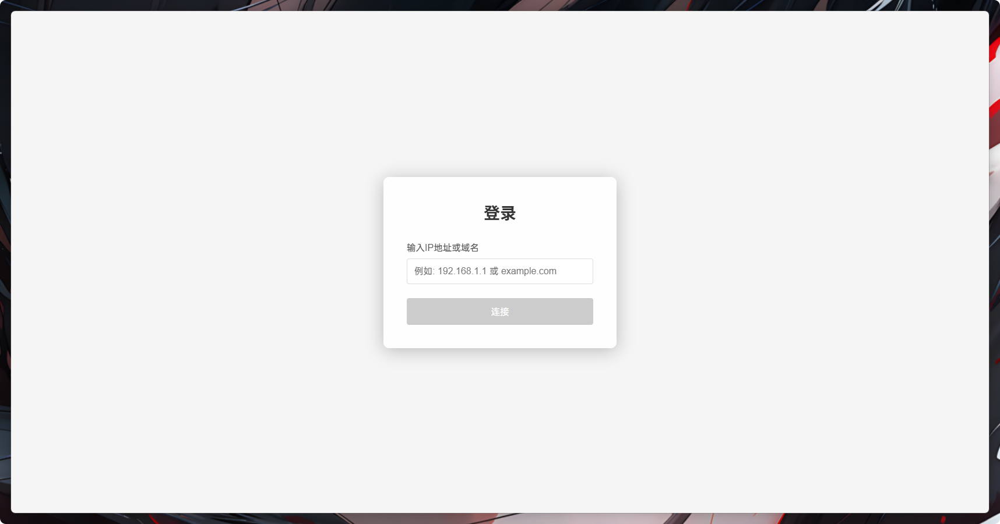
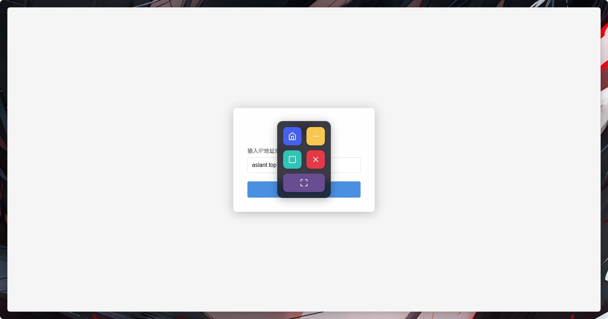

# 浏览器Plus

一个基于 Electron 的增强型浏览器应用，提供无边框设计和悬浮式控制面板，为特定场景(演示)优化。

## 演示截图






## 主要特性

- 屏蔽调试模式
- 屏蔽快捷键
- 屏蔽Alt+F4关闭窗口
- 屏蔽鼠标文字选中
- 屏蔽鼠标右键菜单
- 美化滚动条
- 无边框设计+悬浮式控制面板
- 去除SSL警告
- 支持本地配置文件

## 部署

本项目使用 `electron-builder` 进行打包。

### 环境准备

请使用 Node.js 22.12+ 和 pnpm 12.3.4（可通过 `corepack enable pnpm` 启用）：

```bash
pnpm install
pnpm start          # Electron 开发模式
pnpm run check      # 检查 renderer、Electron、shared 和构建配置
pnpm run build      # 检查并构建 renderer
```

### 打包命令

```bash
pnpm run build:electron  # 检查并打包
make build               # 同上
make clean               # 清理构建产物、缓存、日志和临时文件
make distclean           # 在 clean 基础上删除 node_modules 和本地 pnpm store
```

需要跳过类型检查时可使用 `pnpm run build:electron-fast`。

您可以根据目标平台运行以下命令：

- **打包为 Windows 应用:**
  ```bash
  pnpm run build:win
  ```

- **打包为 macOS 应用:**
  ```bash
  pnpm run build:mac
  ```

- **打包为 Linux 应用:**
  ```bash
  pnpm run build:linux
  ```

打包后的文件将位于 `build` 目录下。

## 使用说明

### 配置文件

您可以在应用程序根目录创建一个 `config.json` 文件来配置应用的启动行为。配置文件中的设置将优先于命令行参数。

配置文件示例：
```json
{
  "link": "asdasd.com",
  "mode": "fullscreen",
  "window": "top",
  "page": "single",
  "hide": "home,close",
  "bg": "C:/path/to/background.jpg"
}
```

## 📋 所有支持的配置项

| 配置项 | 命令行参数 | 配置文件字段 | 说明 | 示例值 |
|--------|------------|-------------|------|--------|
| 启动链接 | `-link=<url>` | `"link": "<url>"` | 指定启动时加载的URL | `"https://www.bing.com"` |
| 窗口模式 | `-mode=<mode>` | `"mode": "<mode>"` | 设置窗口模式 | `"fullscreen"` |
| 窗口置顶 | `-window=<type>` | `"window": "<type>"` | 使窗口保持在最顶层 | `"top"` |
| 页面模式 | `-page=<type>` | `"page": "<type>"` | 启用单页模式 | `"single"` |
| 主题设置 | `-theme=<theme>` | `"theme": "<theme>"` | 设置深色/浅色主题 | `"dark"`, `"light"` |
| 隐藏元素 | `-hide=<elements>` | `"hide": "<elements>"` | 隐藏指定UI元素 | `"control,scroll,theme"` |
| 背景图片 | `-bg=<path>` | `"bg": "<path>"` | 设置登录界面背景图片 | `"C:/bg/image.jpg"` |

### 配置优先级

1. **配置文件** - 最高优先级
2. **命令行参数** - 中等优先级  
3. **默认值** - 最低优先级

### 主题配置

- `light`: 浅色主题（默认）
- `dark`: 深色主题
- 支持系统主题自动检测
- 用户手动切换会保存到本地存储

### 隐藏元素配置

| 隐藏元素 | 说明 | 状态 |
|----------|------|------|
| `control` | 隐藏整个控制面板 | ✅ 已实现 |
| `theme` | 隐藏主题切换按钮 | ✅ 已实现 |
| `scroll` | 隐藏滚动条（保持滚动功能） | ✅ 已实现 |
| `home` | 隐藏主页按钮 | ✅ 已实现 |
| `minimize` | 隐藏最小化按钮 | ✅ 已实现 |
| `maximize` | 隐藏最大化按钮 | ✅ 已实现 |
| `close` | 隐藏关闭按钮 | ✅ 已实现 |
| `fullscreen` | 隐藏全屏按钮 | ✅ 已实现 |

### 命令行参数

您可以在执行程序时附加以下参数来自定义启动行为：

- `-link=<url>`: 指定启动时加载的URL。
  - **示例:** `Box.exe -link=www.bing.com`

- `-mode=fullscreen`: 以全屏模式启动。
  - **示例:** `Box.exe -mode=fullscreen`

- `-window=top`: 使窗口保持在最顶层。
  - **示例:** `Box.exe -window=top`

- `-page=single`: 启用单页模式。在此模式下，点击"主页"按钮将打开系统的用户主目录，而不是返回应用的登录页。
  - **示例:** `Box.exe -page=single`

- `-theme=<theme>`: 设置应用主题。支持 `light`（浅色）和 `dark`（深色）两种主题。
  - **示例:** `Box.exe -theme=dark`
  - **示例:** `Box.exe -theme=light`

- `-hide=<elements>`: 隐藏UI元素。支持隐藏控制面板按钮、主题切换按钮、滚动条和鼠标光标。
  - `control`: 隐藏整个控制面板
  - `theme`: 隐藏主题切换按钮
  - `scroll`: 隐藏滚动条（保持滚动功能）
  - `mouse`: 隐藏鼠标光标（在输入框中仍显示文本光标）
  - `home`, `minimize`, `maximize`, `close`, `fullscreen`: 隐藏对应的控制按钮
  - **示例:** `Box.exe -hide=control,scroll`
  - **示例:** `Box.exe -hide=theme,mouse`
  - **示例:** `Box.exe -hide=home,close`

- `-bg=<path>`: 设置登录界面的背景图片。
  - **示例:** `Box.exe -bg=C:/backgrounds/image.jpg`

### 常用组合示例

```bash
# 企业部署：深色主题 + 隐藏主题切换
 Box.exe -theme=dark -hide=theme

# 极简模式：全屏 + 隐藏所有控制元素
Box.exe -mode=fullscreen -hide=control,scroll

# 演示模式：深色主题 + 隐藏滚动条
Box.exe -theme=dark -hide=scroll

# 沉浸模式：隐藏鼠标光标 + 控制面板
Box.exe -hide=mouse,control

# 自定义界面：指定网站 + 隐藏部分按钮
Box.exe -link=https://example.com -hide=minimize,maximize
```

### 开发环境使用

在开发环境中通过 pnpm 脚本传递参数（pnpm 会将脚本名后的参数直接转发给脚本）：

```bash
pnpm run start -theme=dark
pnpm run start -hide=control,scroll
pnpm run start -theme=dark -hide=theme
```

### 快捷键

应用内置了以下快捷键以方便操作：

- `Ctrl + Shift + Alt`: 切换应用内悬浮控制面板的显示与隐藏.
